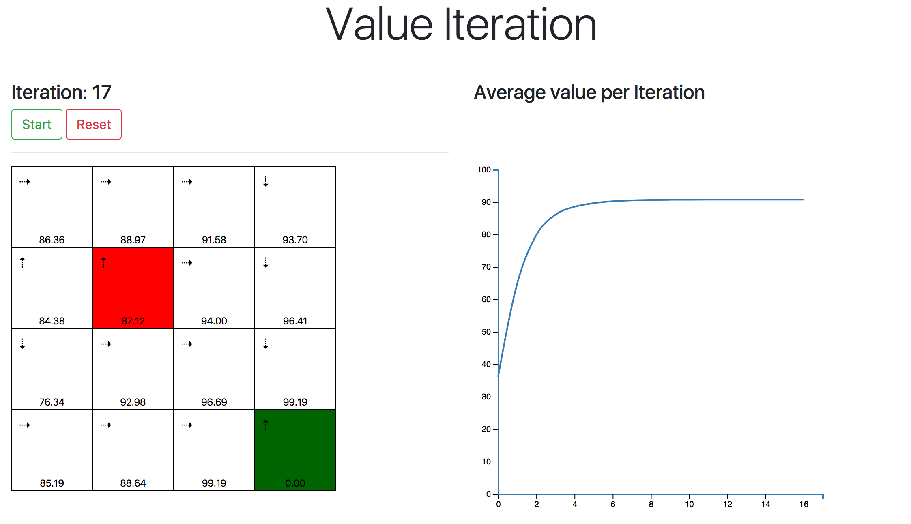
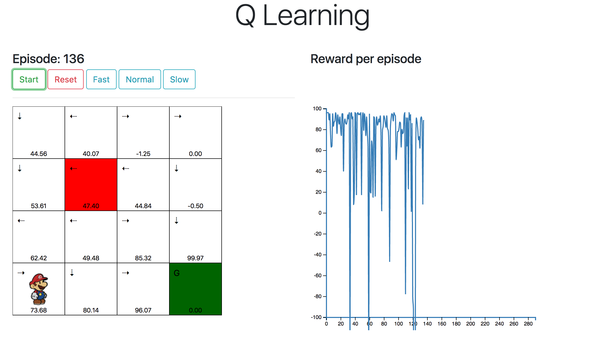

# Reinforcement Learning 

Implementation and visualisation of Value Iteration and Q-Learning on an 4x4 stochastic GridWorld.

## Overview

- The Grid environment and it's dynamics are implemented as ```GridWorld``` class in ```environment.py```, along with utility functions ```grid```,  ```print_grid``` and ```play_game```.
- Value Iteration algorithm and Q-learning algorithm is implemented in ```value_iteration.py```. and ```q_learning.py``` respectively.
- Working of the algorithms are demonstrated in Jupyter notebook ```solution.ipynb```
- A web server implemented in ```app.py``` defines two routes ```/qlearning``` and ```/valueiteration``` for displaying the web visualisation for each of the algorithms. ```/qlearning``` also accepts GET parameters ```episodes```, ```epsilon``` and ```alpha``` for tuning the algorithm 
- Cloud deployed instance can be accessed from:
  - http://deeprl.herokuapp.com/valueiteration
  - http://deeprl.herokuapp.com/qlearning

## Environment

The environment for reinforcement learning is a 4x4 Grid. 

- **State space**

  The grid has 4x4 i.e. 16 distinct states. The 'Start State' is 1x0 cell, cell 3x1 is referred to as 'Bad State' and the cell 3x3 is referred to as  'Goal State'.

  The states in the grid are represented as a tuple of ```(row,col)```.

- **Actions**

  The agent can perform any of the four actions UP, DOWN, LEFT and RIGHT.

  The grid maintains a ```actions``` dictionary with actions that are legal for each state in the grid.

- **Environment Dynamics**

  The Grid is a stochastic environment, which does not ensure same new state given each state and actions. The dynamics of this particular grid are defined by stochastic transitions below

  | Agent Action | Possible Actions  |  Probability  |
  | :----------: | :---------------: | :-----------: |
  |      UP      |  UP, RIGHT, LEFT  | 0.8, 0.1, 0.1 |
  |     DOWN     | DOWN, RIGHT, LEFT | 0.8, 0.1, 0.1 |
  |     LEFT     |  LEFT, UP, DOWN   | 0.8, 0.1, 0.1 |
  |    RIGHT     |  RIGHT, UP, DOWN  | 0.8, 0.1, 0.1 |

  Whenever agent tries to go against the wall of the grid, he ends up in the same state recurring additional reward of the same state.

  These stochastic dynamics are handled by ```transition``` method of the grid environment, which can return both possible transitions (Value Iteration) as well as just the transition taken by the environment (for Q Learning).

- **Rewards**

  The agent receives -1 reward for every state other than the Bad State and Goal State. The agent receives -70 in the Bad State whereas it receives 100 in the Goal State. Upon reaching Goal State the agent is reset back to Start State.

  The grid maintains a ```rewards``` dictionary with rewards corresponding to each state in the grid.


## Value Iteration

Value Iteration is a dynamic programming based planning algorithm and thus assumes full knowledge of the MDP . It is based on the principle that if we know the value of subproblems, then optimal solution can be found by one step lookahead using Bellman's Optimality Equation:
$$
V(s) = max_a\sum_{s\prime}\sum_r p(s\prime,r|s,a) \left (r + \gamma V(s\prime)\right)
$$
Value iteration applies this updates iteratively. The difference of Value Iteration with Policy Iteration is that no explicit policy is maintained.

Value Iteration works for stochastic MDPs as well, which is great for our stochastic grid environment.

**Implementation**

The environment's ```transition``` method returns all the possible states the agent might end up at along with the probabilities and rewards for each of those state, given an action.

For example, if the agent is on state (2,2) and takes DOWN action, then the method returns a list of tuples of all the possible states it might end up in by stochastic action DOWN, RIGHT and LEFT with probabilities 0.8, 0.1 and 0;1 respectively:

```python
[(0.8,(3,2),-1),(0.1,(2,3),-1),(0.1,(2,1),-1)]
```

We then iterate over these possible transitions to calculate state-valued function as below:

```python
new_V = {'U': 0, 'D': 0, 'L': 0, 'R': 0}
for action in actions:
    possible_transitions = env.transition(action, state)
    for prob, next_state, reward in possible_transitions:
        new_V[action] += prob * (reward + discount_factor * V[next_state])
```

We repeat the calculation and update of state-valued function until we converge to the optimal values i.e. until the changes are smaller than the given threshold.

```python
while True:
    delta = 0
    for state in all_states:
        best_V, _ = calculate_v(V, state, env.actions[state])
        delta = max(delta, np.abs(best_V - V[state]))
        V[state] = best_V
    if delta < threshold:
        break
```

Finally we get our optimal policy by taking the max of values for each action for every state.

## Q Learning

Q Learning is off policy Temporal Difference learning, which means we learn optimal policy $$\pi $$ while following behaviour policy $$\mu$$. 

We choose next action $$a_{t+1}$$ using the behaviour policy $$\mu$$, but we also consider alternative successor action $${a\prime_{t+1}}$$ had we been following our target policy $$\pi$$.  We then update action valued function $$Q(s,a)$$ towards alternative action under our target policy as:
$$
Q(s,a) = Q(s,a) + \alpha \left[ r + \gamma max_{a'}Q(s',a') - Q(s,a)\right]
$$
Our behaviour policy $$\mu$$ is $$\epsilon-greedy$$, so we take optimal action with $$(1-\epsilon)$$ probability and take random  action with $$\epsilon$$ probability. This ensures continual exploration.


**Implementation**

Since Q Learning is model free control, our stochastic transition model is hidden by the environment. So unlike in Value Iteration, the environment's ```transition``` method just returns the state and reward agent lands on stochastically according to the probabilities. So we base our updates based on the agent's previous experiences from interacting with the environment.

We also use $$\epsilon-greedy$$ exploration:

```python
p = np.random.random()
if p < (1 - epsilon): return action
else: return np.random.choice(all_actions, 1)
```

For every episode, we choose our ```action``` using this exploration scheme for every ```state``` in the episode. Then we transition based on this action and land on ```new_state```. Now we choose the best action to take in this state as ```best_next_action``` and perform our update:

```python
td_target = reward + discount_factor * Q[new_state][best_next_action]
Q[state][action] += alpha * (td_target - Q[state][action])
```

Finally we get our optimal policy by taking the max of values for each action for every state.


## Visualization

The visualization of the algorithms are implemented using D3 javascript library in ```q_learning.html``` and ```value_iteration.html```. The Flask server runs the algorithms and renders the templates ```q_learning.html``` and ```value_iteration.html``` with the data generated for each episode/iteration.

In each of the visualization, there is an environment grid and a line chart. The grid represents the environment for our algorithms. Every state has an arrow and a numerical value, representing the best action per current policy and the value respectively. The *Bad State* is colored red and *Goal State* is colored green.

The value iteration visualization plots average value of all the states for each iteration of the updates. 



The Q Learning visualization plots reward agent incurs by taking the actions in each episode. We can also see the agent's behaviour in the grid for each episode.



## Future Work

1. It can be noticed in the result of Q Learning that agent seems to get stuck sometimes and incur a large negative reward. A decaying $$\epsilon-greedy$$ exploration scheme can be implemented to reduce agent's spurious behaviour with time.
2. The grids in the visualization are updated only after the current episode/iteration is complete. Policy and values in the grid should be updated online to reflect the online updates made by the algorithms.
3. Currently the visualization data is rendered directly on to the templates. A better approach may be to make asynchronous request and load JSON data.
4. Implement Monte Carlo, TD($$\lambda$$), SARSA and DQN and other techniques like eligibility traces, priority sweeping etc.

## References

1. [Reinforcement Learning: An Introduction, Sutton and Barto](http://incompleteideas.net/sutton/book/bookdraft2017june19.pdf)

2. https://www.edx.org/course/artificial-intelligence-uc-berkeleyx-cs188-1x

3. https://www.cs.cmu.edu/~avrim/ML14/lect0326.pdf

4. http://www.cs.toronto.edu/~darius/papers/POMDP_survey.pdf

5. [Reinforcement Learning | Udacity](https://www.google.co.in/url?sa=t&rct=j&q=&esrc=s&source=web&cd=1&cad=rja&uact=8&ved=0ahUKEwjJsM-2m7PWAhVDMo8KHRc3CgcQFggqMAA&url=https%3A%2F%2Fwww.udacity.com%2Fcourse%2Freinforcement-learning--ud600&usg=AFQjCNG6nXA3p_YAHo0zI-tJf-lzCv6E7g)

6. [CS 294: Deep Reinforcement Learning, Fall 2017](http://rll.berkeley.edu/deeprlcourse/)

7. [Deep Reinforcement Learning: Pong from Pixels, Andrej Karpathy](http://karpathy.github.io/2016/05/31/rl/)

   ​

